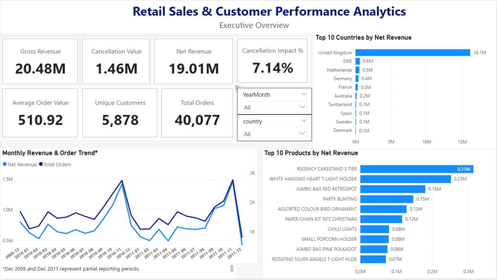
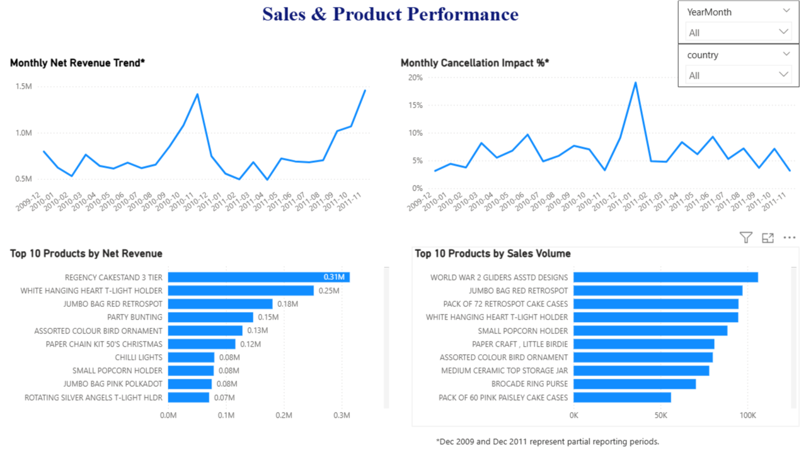
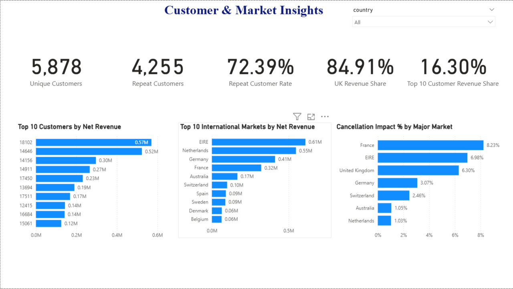

# Retail Sales & Customer Performance Analytics

## Project Overview

This project is an end-to-end business analytics case study using real-world retail transaction data.

The analysis focuses on understanding business performance through sales, customers, products, markets, and transaction behavior while giving particular attention to data quality and the reliability of conclusions drawn from the data.

Rather than starting directly with visualization, the project follows an analytical workflow beginning with business understanding, data validation, and investigation of potential data-quality issues.

---

## Business Objective

The objective of this project is to help business stakeholders understand:

- how sales performance changes over time,
- which products and markets contribute most to business performance,
- how customer purchasing behavior affects revenue,
- where cancellations or unusual transactions may affect reported performance,
- and which patterns deserve further business investigation.

The final goal is to convert transactional data into reliable business insights and decision-support recommendations.

---

## Analytical Approach

The project follows this workflow:

**Business Understanding → Data Understanding → Data Quality Assessment → Data Preparation → Exploratory Analysis → SQL Analysis → Customer & Product Analysis → Data Modeling → Power BI → Business Insights & Recommendations**

A key principle throughout the project is:

> Data will not be removed or modified simply because it appears unusual. Suspicious records will first be investigated in the context of the dataset and business process.

---

## Dataset

**Dataset:** Online Retail II  
**Source:** UCI Machine Learning Repository

The dataset contains transactional data from a UK-based non-store retailer covering approximately two years.

The raw workbook contains two yearly worksheets and transaction-level fields related to invoices, products, quantities, prices, customers, dates, and countries.

The raw data was profiled and investigated before transformation rules were applied, with particular attention to missing values, cancellations, duplicate records, overlapping source periods, unusual transactions, and inconsistent product descriptions.

---

## Project Progress

The project has progressed from raw-data investigation through SQL analysis, data modeling, and interactive Power BI reporting.

Completed work includes:

- profiling and validating more than 1 million raw transaction rows,
- investigating missing values, cancellations, unusual transactions, and exact duplicates,
- identifying and resolving cross-period overlap between the source worksheets,
- building a reproducible SQL transformation and analysis workflow,
- analyzing sales, products, customers, markets, and cancellation behavior,
- building a dimensional model for business reporting,
- creating DAX measures for key business KPIs,
- and developing a three-page Power BI dashboard.

---

## Power BI Dashboard

The Power BI report translates the validated analytical results into three business-focused views.

### Executive Overview

Provides a management-level view of revenue, orders, customers, cancellation impact, monthly performance, leading products, and geographic performance.

### Sales & Product Performance

Explores monthly net revenue, cancellation impact over time, leading products by net revenue, and products with the highest sales volume.

### Customer & Market Insights

Examines repeat-customer behavior, customer revenue concentration, international market performance, UK revenue concentration, and cancellation impact across major markets.

---

## Tools & Technologies

- **PostgreSQL / SQL** — data validation, transformation, reconciliation, and business analysis
- **Power Query** — data preparation for reporting
- **Power BI** — dimensional modeling, DAX measures, interactive analysis, and dashboard development
- **GitHub** — project documentation and reproducible analytical workflow

---

## Key Validated KPIs

- **Gross Revenue:** 20.48M
- **Cancellation Value:** 1.46M
- **Net Revenue:** 19.01M
- **Cancellation Impact:** 7.14%
- **Total Sale Orders:** 40,077
- **Identified Customers:** 5,878
- **Repeat Customers:** 4,255
- **Repeat Customer Rate:** 72.39%
- **UK Share of Net Revenue:** 84.91%
- **Top 10 Customer Revenue Share:** 16.30%

> December 2009 and December 2011 represent partial reporting periods and are interpreted accordingly in time-based analysis.

---

## Repository Structure

- `data/` — dataset source and processing documentation
- `docs/` — data understanding, data-quality assessment, and validated insight documentation
- `sql/` — reproducible SQL workflow covering transformation, validation, and business analysis
- `powerbi/` — Power BI report file, dashboard documentation, and final dashboard screenshots

---

## Project Status

✅ **Core analysis and Power BI dashboard completed**

The repository documents the analytical process from raw-data investigation and quality validation through SQL analysis, business interpretation, and interactive reporting.
